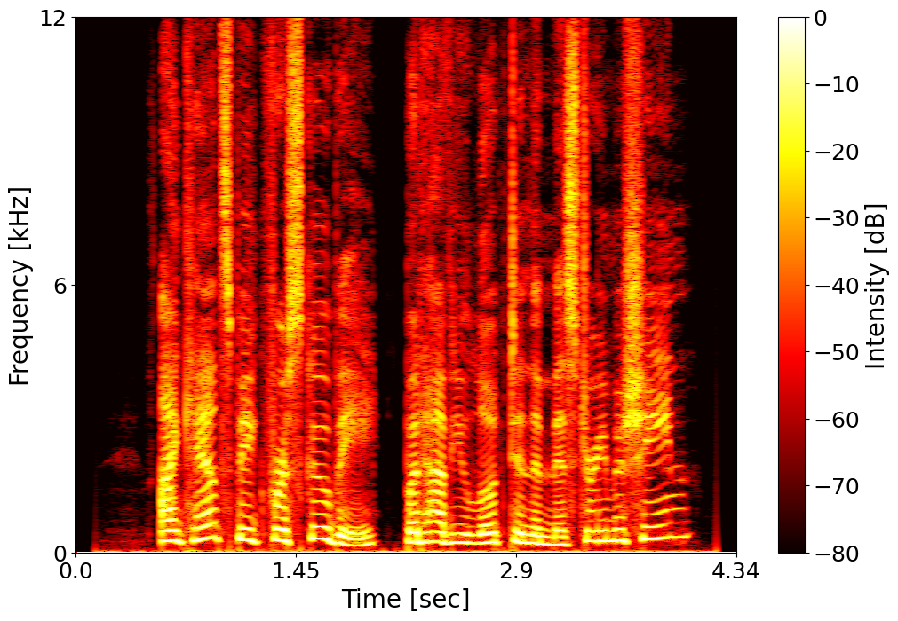
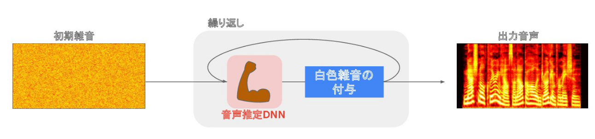
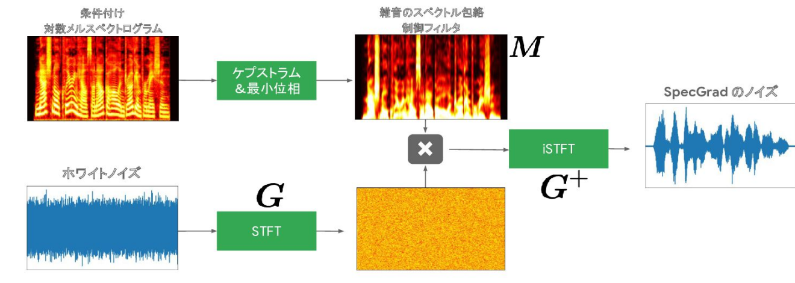
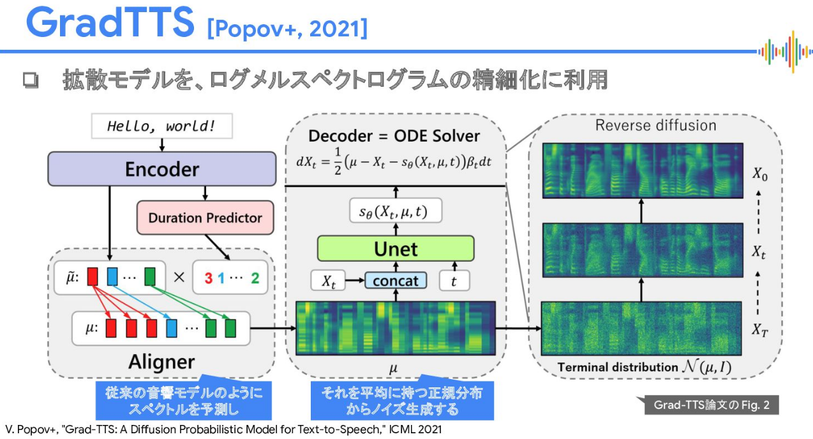

**学習ログ**: 2024-01-17

# 拡散モデルと自己教師あり学習を用いた音声生成

## 概要
このドキュメントは、拡散モデルと自己教師あり学習を用いた音声生成に関する研究を中心に、音声合成技術の進歩を要約しています。

## 目次
- [拡散モデルによる音声生成](#拡散モデルによる音声生成)
- [音声生成の段階](#音声生成の段階)
  - [音響モデリング](#音響モデリング)
  - [音声波形生成](#音声波形生成)
- [重要な音響処理や特徴量](#重重要な音響処理や特徴量)
  - [STFT](#STFT)
  - [メルスペクトログラム](#メルスペクトログラム)
- [先進的な音声合成モデル](#先進的な音声合成モデル)
  - [WaveGrad](#WaveGrad)
  - [SpecGrad](#SpecGrad)
  - [Grad-TTS](#Grad-TTS)
- [TTSシステムの重要コンポーネント](#TTSシステムの重要コンポーネント)
  - [Duration Predictor](#Duration-Predictor)
- [自己教師あり学習](#自己教師あり学習)

## 拡散モデルによる音声生成
「音をつくるための拡散モデル」という講演では、拡散モデルを用いた音声生成に関する最新の研究が紹介されました。この講演は、音声生成分野における拡散モデルの重要性と応用方法に深い洞察を提供し、音声合成技術の進化に対する重要な貢献を示しています。

### 拡散モデルの基本的なアイディア
拡散モデルは、元のデータに徐々にノイズを加えてランダムノイズに変換する前方拡散過程と、ノイズから元のデータを再構築する逆拡散過程の二つのプロセスを含みます。

- 理論的背景
    - **マルコフ連鎖**: 各ステップが直前のステップのみに依存します。
    - **変分推論**: 逆拡散プロセスは変分推論の枠組みを利用しています。
    - **損失関数と最適化**: 特定の損失関数を用いてネットワークを最適化します。

- 応用分野
    - **画像生成**: 高品質な画像生成に利用されます。
    - **データ拡張**: 既存のデータセットの拡張にも応用されます。
    - **ノイズ除去や超解像**: 画像の品質向上に利用されます。

- 特徴と課題
    - **高品質な生成**: 他の生成モデルと比較して詳細な画像を生成できます。
    - **制御可能性**: 生成される画像の特定の属性を制御できます。
    - **計算コスト**: 高品質な結果を得るためには計算リソースが必要です。
    - **計算効率**: 計算が重いため、リアルタイムアプリケーションには適していないことがあります。
    - **最適化の難しさ**: 大規模なデータセットを使用する場合、適切なハイパーパラメータの選択が重要です。

## 音声生成の段階
音声生成は、深層学習を用いて一般的に音響モデリングと波形生成の二段階で行われます。このプロセスは、音声の基本的な特徴を生成し、それを実際の音声波形に変換することを目的としています。

### 音響モデリング
音響モデリング（Acoustic Modeling）では、音声のピッチ、タイミング、音色などの基本的な特性が生成されます。この段階で生成される音響特徴量（例えば、メル周波数ケプストラム係数、MFCC）は、音声の持続時間やリズム、話者のアイデンティティや感情などを表します。これらの特徴量は、次の波形生成段階への入力として使用されます。

### 音声波形生成
音響モデリング（Vocoder）で生成された特徴量を基に、実際の音声波形が生成されます。このプロセスは、時間領域または周波数領域での波形の再構築を含み、現代の音声波形生成モデル（例えば、WaveNetやWaveGlow）を用いて、自然で滑らかな音声を生成します。これにより、音声の感情や話し方など、より細かいニュアンスが表現されます。

## 重要な音響処理や特徴量
### STFT
STFTは、音声や音楽などの時間依存信号の周波数成分を分析するツールです。

- **プロセス**
    1. **信号の分割**: 短いフレームに分割。
    2. **窓関数の適用**: より滑らかな周波数解析のために窓関数を適用。
    3. **フーリエ変換**: 各フレームでフーリエ変換を行い、周波数スペクトルを抽出。
    4. **スペクトログラムの生成**: スペクトログラムにより、時間経過に伴う信号の周波数内容を視覚化。

-  **応用**
    - 音声信号処理、音楽解析、振動解析などに広く用いられる重要なツールです。

### メルスペクトログラム
メルスペクトログラムは、音声信号の周波数内容を時間経過に沿って表現する重要な音響特徴量です。この特徴量は、スペクトログラムの形式で、音声信号の周波数成分を視覚化します。

    

- **メルスペクトログラムの構成要素**
    - **スペクトログラム**: 音声信号の周波数成分を時間軸に沿って視覚化します。縦軸は周波数を、横軸は時間を表し、色や明るさで音の強度（振幅）を示します。
    - **メル尺度**: メル尺度は人間の耳の感覚を模倣した周波数尺度です。低周波数の変化に敏感で、高周波数では感度が低くなる特性を持ちます

- **メルスペクトログラムの重要性**
メルスペクトログラムは、音声の特徴を人間の聴覚に近い形で捉えることができ、音声認識や合成における重要な役割を果たします。特に、音声の異なる特性を区別する能力が高く、音声合成の精度と自然さを向上させるための基礎となります。

## 先進的な音声合成モデル
### WaveGrad
WaveGradは、拡散モデルを利用した音声生成モデルの一つです。特に音声波形の生成に焦点を当て、高品質な音声の生成を目指しています。

    

- **特徴**
    1. **拡散モデルの利用**: 画像生成で用いられる拡散モデルを音声生成に適用。
    2. **逆拡散プロセス**: ノイズから始めて、段階的に音声波形を生成。
    3. **条件付き生成**: メルスペクトログラムなどの特徴量に基づいて音声波形を生成。
    4. **高品質な音声**: 自然で細かなニュアンスや感情表現を捉える能力を有します。

### SpecGrad
SpecGradは、デノイジング拡散確率モデルを基にしたニューラルボコーダーです。音声の生成品質を向上させるために拡散ノイズの分布を音響特徴に適応させます。

    

- **特徴**
    - **高周波帯の音質改善**: 高周波帯の音質を特に改善し、自然で高忠実度の音声を生成。
    - **計算コスト**: 従来のDDPMベースのボコーダーとほぼ同じ計算コスト。
    - **拡散ノイズの適応**: 音声生成品質の向上に寄与します。

### Grad-TTS
Grad-TTSは、テキストから音声への合成に使用されるモデルで、拡散確率モデルに基づいています。徐々にノイズを変換しメルスペクトログラムを生成することが特徴です。

    

- **特徴**
    - **拡散確率モデル**: 拡散確率モデルに基づく音声波形生成。
    - **逆拡散プロセス**: 段階的に音声波形を生成し、品質を向上させます。
    - **条件付き生成**: 特徴量に基づいて音声波形を生成。
    - **音質と推論速度のトレードオフ**: 音質と速度のバランスを制御可能。

- **枠組み**
    - 拡散確率モデルを一般化し、ノイズから高品質なメルスペクトログラムを再構築。
    - デコーダはデータのログ密度の勾配をモデル化し、テキストエンコーダに条件付けされています。
    - 音声特徴の生成に焦点を当て、リアルタイム合成が可能。

### Grad-TTS
Grad-TTSは、テキストから音声への合成に使用されるモデルで、拡散確率モデルに基づいています。徐々にノイズを変換しメルスペクトログラムを生成することが特徴です。

-  **特徴**
    - **拡散確率モデル**: 拡散確率モデルに基づく音声波形生成。
    - **逆拡散プロセス**: 段階的に音声波形を生成し、品質を向上させます。
    - **条件付き生成**: 特徴量に基づいて音声波形を生成。
    - **音質と推論速度のトレードオフ**: 音質と速度のバランスを制御可能。

- **枠組み**
    - 拡散確率モデルを一般化し、ノイズから高品質なメルスペクトログラムを再構築。
    - デコーダはデータのログ密度の勾配をモデル化し、テキストエンコーダに条件付けされています。
    - 音声特徴の生成に焦点を当て、リアルタイム合成が可能。

## TTSシステムの重要コンポーネント
### Duration-Predictor
Duration predictorは、TTSシステムで音声の各音素または単語の持続時間を予測するコンポーネントです。

- **役割**
    - **時間予測**: テキストの各単位の音声出力での持続時間を予測。
    - **自然なリズム生成**: 正確な持続時間予測により、自然な音声を生成。
    - **音声合成品質の向上**: 持続時間予測の精度が音声合成の品質に影響。

- **原理**
    - ニューラルネットワークを使用し、テキストデータから持続時間を予測。
    - 予測された持続時間は音声波形生成の際に使用されます。

- **応用**
    - 高品質なTTSシステムに広く利用され、自然な音声の流れとリズムを提供。

## 自己教師あり学習
自己教師あり学習は、教師あり学習と教師なし学習の中間のアプローチで、未ラベルデータから自動的にラベルを生成し、それを用いてモデルを訓練します。この方法は、隠された部分の予測やテキストの次の単語の予測など、様々なタスクに適用されます。

- **特徴**
    - **大量の未ラベルデータの活用**: 豊富な特徴を学習し、汎用性の高いモデルを構築できます。
    - **応用分野**: 画像認識、自然言語処理、音声認識など多岐にわたります。

この学習方法は、データの自然な特性を活かし、実世界の複雑なタスクに適用可能なモデルを生成するために重要です。

### 参考文献
- [音をつくるための拡散モデル 第49回IBISML研究会 招待講演資料](https://speakerdeck.com/yumakoizumi/yin-wotukurutamenokuo-san-moderu?)
- [拡散確立モデルと音声波形生成 琉球大学での招待講演（2022/07/06）のスライド](https://speakerdeck.com/yumakoizumi/kuo-san-que-lu-moderutoyin-sheng-bo-xing-sheng-cheng?)
- [SpecGrad: 適応型ノイズスペクトル整形を用いた拡散確率モデルベースニューラルボコーダ](https://wavegrad.github.io/specgrad/)
- [Grad-TTS: 音声合成のための拡散確率モデル](https://grad-tts.github.io/)