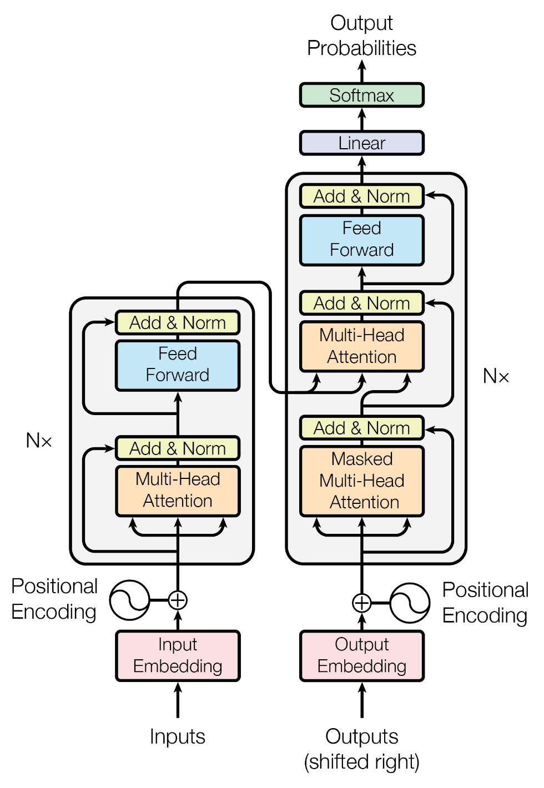
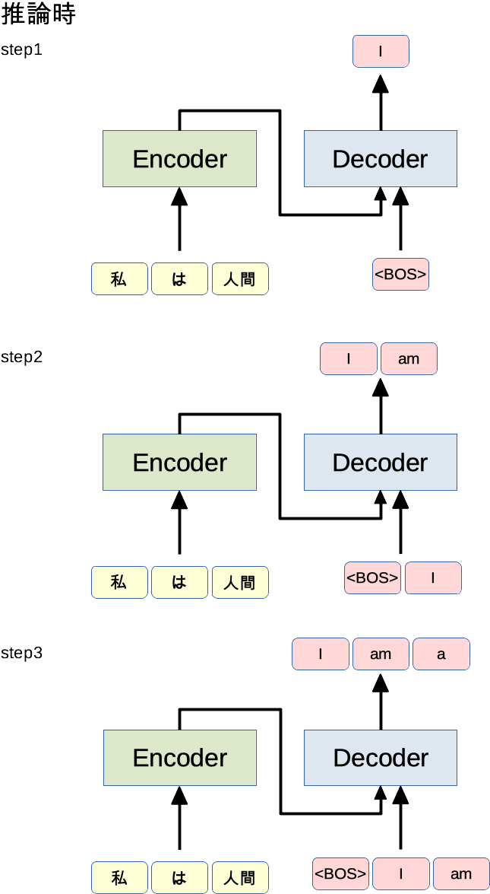

**学習ログ**: 2024-01-18

# 研究に関する興味深い記事まとめ

## 概要
TransformerやDiffusion modelの理解や実装に役立ちそうな記事をまとめています．

## 目次
- [図で理解するTransformer](#図で理解するtransformer)
- [DiffusionモデルをPyTorchで実装する① ~ Diffusionモデル実装編](#diffusionモデルをpytorchで実装する①--diffusionモデル実装編)
- [DiffusionモデルをPyTorchで実装する② ~ U-Net編](#)
- [記事のタイトル](#記事のタイトル)

## 図で理解するTransformer
- **URL**：[図で理解するTransformer](https://qiita.com/birdwatcher/items/b3e4428f63f708db37b7)
- **キーワード**：Transformer，Encoder，Decoder，Attention，Scaled Dot-Product Attention，Multi-Head Attention，
- **概要**：Transformerの学習や推論の処理を分かりやすく詳細に書いていて参考になりそう．数式もちゃんとある．
### 参考になりそうな情報
- **Transformerの全体像**
<div align="center">
    
</div>

<details>
<summary>その他の画像</summary>

- **推論時**
<div align="center">
    
</div>
</details>

## DiffusionモデルをPyTorchで実装する① ~ Diffusionモデル実装編
- **URL**：[DiffusionモデルをPyTorchで実装する① ~ Diffusionモデル実装編](https://data-analytics.fun/2022/08/24/diffusion-model-pytorch-1/)
- **キーワード**：Pytorch，Diffusionモデル，U-Net，
- **概要**：本記事ではタイトル通りDiffusionモデルをPytorchで実装するための原理とコードを紹介している．①となる今回は，Diffusionモデルの基本的な仕組みとモデルの実装を行っている．
### 参考になりそうな情報
- **本サイトの解説記事**：[ 『【論文解説】Diffusion Modelを理解する』](https://data-analytics.fun/2022/02/03/understanding-diffusion-model/)
- **元論文**：[『Denoising Diffusion Probabilistic Models』](https://arxiv.org/abs/2006.11239)

## DiffusionモデルをPyTorchで実装する② ~ U-Net編
- **URL**：[DiffusionモデルをPyTorchで実装する② ~ U-Net編](https://data-analytics.fun/2022/08/27/diffusion-model-pytorch-2-unet/)
- **キーワード**：Pytorch，Diffusionモデル，U-Net，Attention，Group Normalization
- **概要**：本記事ではタイトル通りDiffusionモデルをPytorchで実装するための原理とコードを紹介している．②となる今回は，U-Netの実装を行っている．
### 参考になりそうな情報
- **元論文**：[『U-Net: Convolutional Networks for Biomedical Image Segmentation』](https://arxiv.org/abs/2006.11239)

## The Annotated Diffusion Model
- **URL**：[The Annotated Diffusion Model](https://huggingface.co/blog/annotated-diffusion)
- **キーワード**：Pytorch，Annotated Diffusion model，U-Net，Attention，Group Normalization，DDPM，Hugging Face
- **概要**：上述の2つの記事の主にコード面で大本となるサイト．英語なので読みづらいが残隊のきれいな実装方法が確認できる．

### 参考になりそうな情報
- **元論文**：[『U-Net: Convolutional Networks for Biomedical Image Segmentation』](https://arxiv.org/abs/2006.11239)


## StableDiffusionを"完全に理解"したいあなたへ ～AlexNetからControlNetまで～
- **URL**：[StableDiffusionを"完全に理解"したいあなたへ ～AlexNetからControlNetまで～](https://qiita.com/cakkby2/items/52dea58ce15dbb29365a)
- **キーワード**：StableDiffusion，拡散モデル(DDPM)，U-Net，ViT，VAE
- **概要**：StableDiffusionの関連知識のサイトリンクをまとめている．全体像を理解したいときに役立ちそう．
### 参考になりそうな情報

## 記事のタイトル
- **URL**：[代替テキスト](URL)
- **キーワード**：
- **概要**：
### 参考になりそうな情報
<details>
<summary>見出し</summary>
詳細の内容

```rb
puts 'Hello, World'
```
</details>